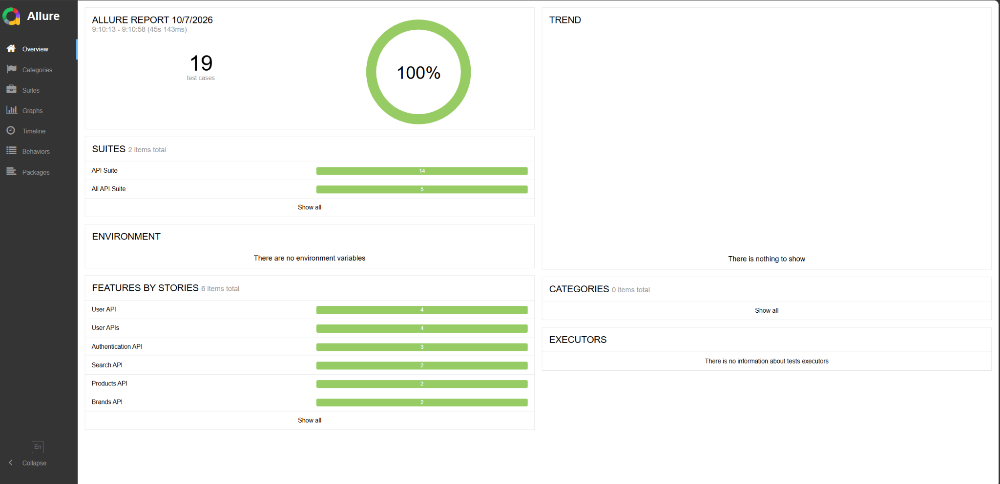

# Automation Exercise - API Testing & Automation

API testing and automation framework for the [Automation Exercise](https://automationexercise.com/) REST APIs, developed using Java, Rest Assured, TestNG, Maven, JSON, and Allure Reports.

The project covers positive and negative API scenarios across product, brand, search, authentication, and user account operations.

---

## 📌 Project Overview

This project was developed to practice and demonstrate API testing and automation skills using a structured Java-based testing framework.

The framework includes:

- REST API functional testing
- Positive and negative test scenarios
- HTTP method validation
- Response status code validation
- JSON response validation
- Request parameter validation
- POJO-based response mapping
- JSON test data handling
- Reusable API utilities
- TestNG test execution
- Maven project management
- Allure test reporting

---

## 🧪 API Testing Scope

The project covers **14 API test scenarios** provided by Automation Exercise.

### Products API

| # | Method | Endpoint | Scenario |
|---|---|---|---|
| 1 | GET | `/productsList` | Verify all products are returned successfully |
| 2 | POST | `/productsList` | Verify unsupported HTTP method handling |

### Brands API

| # | Method | Endpoint | Scenario |
|---|---|---|---|
| 3 | GET | `/brandsList` | Verify all brands are returned successfully |
| 4 | PUT | `/brandsList` | Verify unsupported HTTP method handling |

### Search API

| # | Method | Endpoint | Scenario |
|---|---|---|---|
| 5 | POST | `/searchProduct` | Search for products using a valid search parameter |
| 6 | POST | `/searchProduct` | Verify behavior when the search parameter is missing |

### Login API

| # | Method | Endpoint | Scenario |
|---|---|---|---|
| 7 | POST | `/verifyLogin` | Verify login using valid credentials |
| 8 | POST | `/verifyLogin` | Verify validation when the email parameter is missing |
| 9 | DELETE | `/verifyLogin` | Verify unsupported HTTP method handling |
| 10 | POST | `/verifyLogin` | Verify login with invalid credentials |

### User Account APIs

| # | Method | Endpoint | Scenario |
|---|---|---|---|
| 11 | POST | `/createAccount` | Create a new user account |
| 12 | DELETE | `/deleteAccount` | Delete an existing user account |
| 13 | PUT | `/updateAccount` | Update an existing user account |
| 14 | GET | `/getUserDetailByEmail` | Retrieve user details using email |

---

## 🛠️ Technologies & Tools

| Technology / Tool | Purpose |
|---|---|
| Java | Programming language |
| Rest Assured | REST API automation |
| TestNG | Test execution and test organization |
| Maven | Dependency and project management |
| Gson | JSON test data deserialization |
| Jackson | API response parsing |
| JSON | Test data and API response handling |
| Allure | Test reporting |
| IntelliJ IDEA | Development environment |
| Git | Version control |
| GitHub | Source code management |

---

## 🏗️ Framework Architecture

The project follows a modular structure separating test cases, API configuration, response parsing, validation, POJOs, and test data.

```text
TestNG
   │
   ▼
API Test Cases
   │
   ├── BaseTest
   │      │
   │      └── ConfigReader
   │
   ├── Rest Assured
   │      │
   │      ▼
   │   Automation Exercise APIs
   │
   ├── ResponseParser
   │
   ├── ResponseValidator
   │
   ├── POJO Classes
   │
   └── JSON Test Data
          │
          ▼
      Allure Reports
```


## 📊 Test Execution & Allure Report

The framework is integrated with Allure Reports for visual test execution
results and detailed reporting.

### Latest Execution

| Metric | Result |
|---|---:|
| Total Test Cases | 19 |
| Passed | 19 |
| Failed | 0 |
| Pass Rate | 100% |
| Test Suites | 2 |

### Allure Report Dashboard



